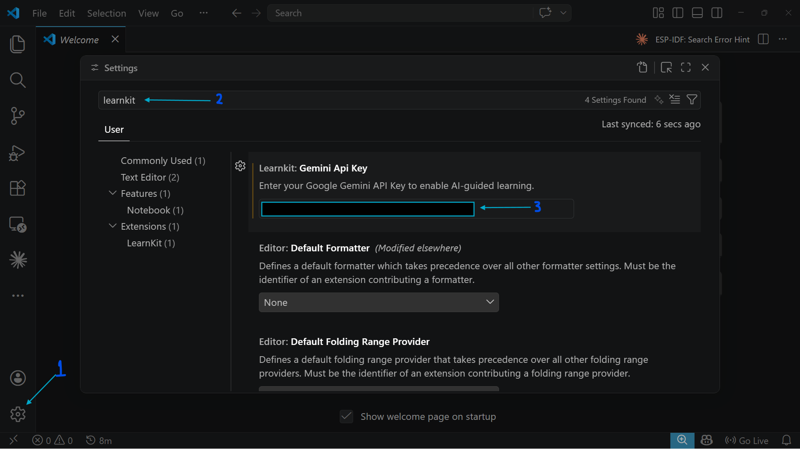

## Learn by Making
This Visual Studio Code extension leverages AI in a educative manner to teach coding by building projects you like. 

### Features
You can prompt the platform with a programming language and your current knowledge level along with a desired project you would like to make, example 3D Website, Hangman or a 2D platformer. 

The system will prompt you in steps and will get you to make the project as that is how best learning takes place, when you make something you enjoy. 

Conversation is locally saved in the project directory to come back in a new coding session. The AI system runs on Google Gemini, specifically their latest Gemini Flash Lite model

### Setup
1. Download the LearnKit extension 
2. Sign in to [Google AI Studio](https://aistudio.google.com/)
3. Get a Google Gemini API Key

4. Copy the API Key and paste it into VSCode LearnKit extension settings

5. Click Ctrl/Cmd + Shift + P to open the command palette and search for "LearnKit: Start project based learning"

### Motivation
This project was created based on my use of Google Gemini's Guided Learning feature. I want to have this experience directly in VS Code. I have used Google Gemini Pro to (vibe)code this project. 

### To Do
- [ ] Revise the basic prompt to make it more comprehensive and tailored for the experience

### credits
Icon by  Pexelpy